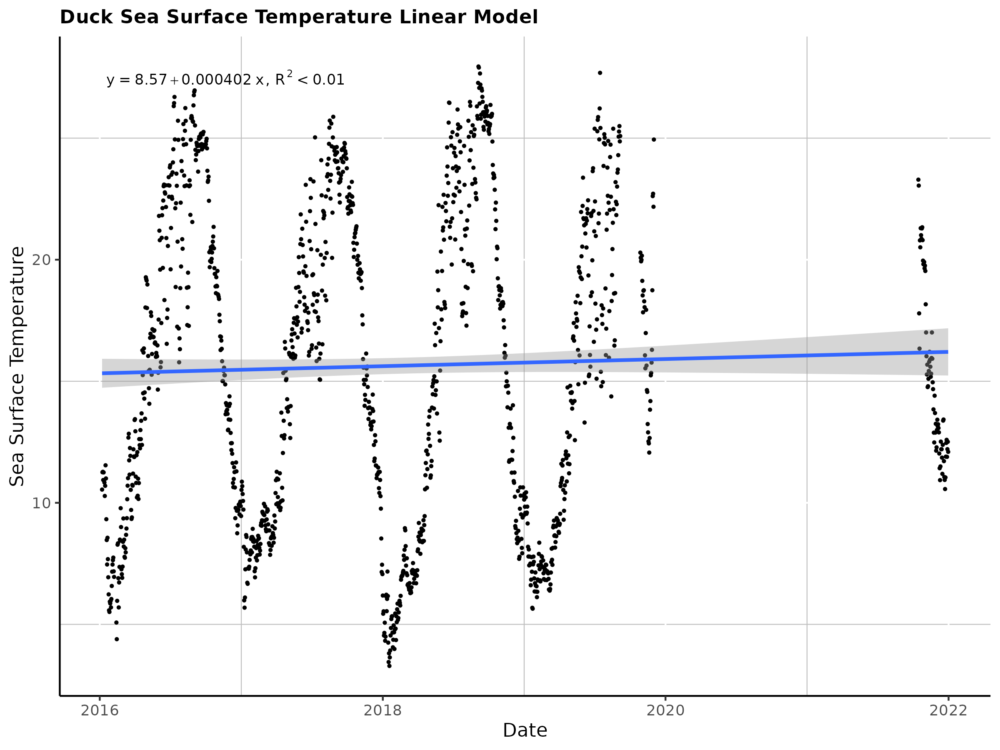
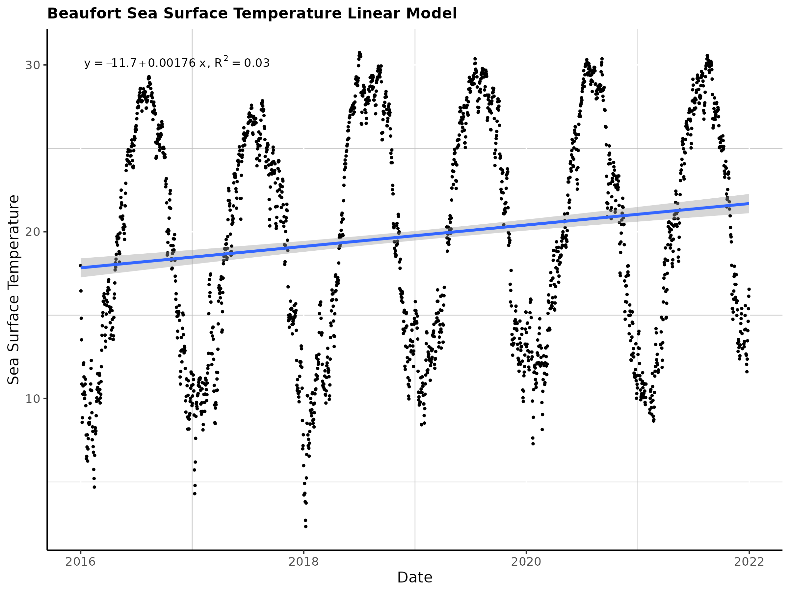

```{r, echo = FALSE}
library(rmarkdown)
library(tinytex)
```

#Camryn Blawas BIOS 611 Final Project

##Introduction

My project will use climatology data from three NOAA buoys near Cape
Hatteras, Duck, and Beaufort North Carolina to understand the trends in
water temperature, specifically in relation to gulf stream changes.
There was a heatwave in North Carolina in 2017 that may have been
amplified by a Gulf Stream warm core ring.

To test this, we can compare water temperature above the Gulf Stream
(Duck), at Gulf Stream shift (Cape Hatteras), and below the Gulf Stream
(Beaufort). In theory, if the Gulf stream did release a warm core ring,
there would be a rapid increase in water temperature most likely
starting at the Duck buoy in early April, and confirmed intrusion of the
later arrival of a surge of near bottom Cold Pool water (Gawarkiewicz et
al., 2019). We can also compare rates of warming between these three
locations and see the overall trends in water temperature on the NC
Coast.

These datasets have a variety of climate based variables including air
temperature, water temperature, wind speed, atmospheric pressure, and a
few other variables that may be of interest. For the purposes of this
project, we are particularly interested in water temperature, as it
would be most indicative of an intrusion of a warm core ring. The
stipulation to the hypothesis that the presence of a warm core ring
would cause higher or lower water temperature is that warm core rings
may cross the shelf, but seeing their presence in shallow coastal waters
(like where these buoys are located) may be difficult due to the warming
at the air-sea interface.

Measurements are taken every 6 minutes, and the dataset spans from 2016
to present day. To make these datasets easily usable, we will average
measurements each day. There is a large gap in data at the Duck buoy due
to water temperature sensors failing from December 2019 to October of
2021, which does not impact the results of the warm core ring
hypothesis, but does affect the overall trend analysis.

Figure 1.  Site Map

##Overall Trend Analysis

To understand any overall water temperature trends over time, I plotted
linear models at each site (Figs. 2, 3, 4). From these models, there
does seem to be a very slightly positive linear trend over time at each
site. The most interesting trend from these models is that it seems that
Beaufort's water temperature may be rising faster than at the other
sites. This is particularly important in a physical oceanography
context, since recent research into destabilization of the Gulf Stream
could be the culprit for the intrusion of warmer waters (Andres et al.,
2016). Other factors that could cause an increase in Beaufort's water
temperature could be atmospheric warming, changes in inlet dynamics due
to storm activity, and other stressors related to global climate change.
To investigate further if there are any seasonal trends, I attempted to
detrend the seasonal curve of the water temperature trend at each site.
I used the "trend" and "tseries" package to take out the seasonal curve
and perform a Mann-Kendall trend test to determine if there was a
seasonal trend. If the p-values were below 0.05, they indicate that
there is a seasonal trend (this should be true at all sites, as
temperature is known to vary with the seasons). This proved to be quite
difficult at Duck, but from the other sites we can begin to see some
conclusions. At Duck, we can see that the functions had a difficult time
teasing out trends with such a large data gap, so the linear fit pretty
much mimics the seasonal trend (Figure 5). At Cape Hatteras, we can see
that the detrended linear model shows slight variations (I've chosen to
ignore the very first curve along with 2016, as I think it is not
detrending well at the very beginning) after 2018, but nothing
incredibly significant, and the p value indicates that the seasonal
trend is present (expected) (Figure 6). At Beaufort, we see quite
similar trends with small fluctuations, but nothing incredibly
indicative of a warm core ring or major increases in temperature, and
the p value indicates that the seasonal trend is present (Figure 7).
From this, we can see that the trend in water temperature and in fact,
seasonal, however there are not extreme fluctuations and this analysis
needs to be refined. To use some dimensionality reduction skills I
learned in class, I attempted a PCA and K Means clustering analysis of
my data. From the PCA of all data at each site combined, I found that
wind direction was contributing 99% of the variance to PC1, which is not
exactly relevant to my overall analysis, but is interesting (Figure 8).
I then performed a clustering, but found the results not indicative of
much (Figure 9). The two clusters seem to be overlapping a lot,
indicating I need to refine my method or that a clustering analysis is
not appropriate for this data. My hope was that a clustering would
result in points that were indicative of storm activity or a warm core
ring, but that does not seem to be the case. I think with a different
dataset I might be able to do this, which I plan on pursuing next
semester.

Figure 2.  Duck Sea Surface Temperature
Linear Model

Figure 3.  Cape Hatteras Sea Surface
Temperature Linear Model

Figure 4.  Beaufort Sea Surface Temperature
Linear Model

Figure 5.  Duck Seasonal Temperature
Trend

Figure 6.  Cape Hatteras Seasonal
Temperature Trend

Figure 7.  Beaufort Seasonal
Temperature Trend

Figure 8.  Biplot of All Data PCA

Figure 9.  Clustering Plot of All Data

## Warm Core Ring Analysis

To understand if there were differences in temperature during late April
that would indicate the presence of a warm core ring, I decided to
compare water temperatures in the month of April during 2017, as well as
weeks where there could have been warm water from the warm core ring or
cold water from the slope. I began by comparing mean water temperature
between years at each site using Wilcoxon nonparametric tests, with
adjusted p values. At Duck, there was a clear decrease in temperature
from 2017 to 2018, but there was no difference between 2016 and 2017,
nor 2019 and 2017, indicating that April was not significantly warmer at
Duck (Duck Blue Boxplot). At Cape Hatteras, there were statistically
significant differences between 2017 and 2016, 2018, 2020, and 2021, but
not 2017 and 2019 (CH Blue Boxplot). This is interesting, because
statistically higher temperatures could indicate intrusion of warm core
ring waters, but a smaller scale is necessary to absolutely confirm this
hypothesis. At Beaufort, there were statistically significant
differences between 2017 and 2016 and 2018, but not 2017 and 2020 nor
2021 (Beaufort Blue Boxplot). This is less indicative of a significance
of April 2017 in terms of increased water temperature because Beaufort
is below the biogeographical barrier, so it is unlikely a warm core ring
would proliferate that far (Hoarfrost et al., 2019). To get at a
hopefully smaller scale, I binned the days of each week in the warm core
ring's possible path down the coast and compared their water
temperatures. Using a Wilcoxon non parametric test, I found no
difference between weeks of possible warm core ring presence (All WCR
Boxplot). This demonstrates that it is not likely that there was a warm
core ring that occurred specifically at these sites during this period
to bring in a water mass of a vastly different temperature.

Figure 10.  Duck April Trend Boxplot

Figure 11.  Cape Hatteras April Trend
Boxplot

Figure 12.  Beaufort April Trend
Boxplot

Figure 13.  All WCR Weeks
Boxplot

##References:

Andres, M. "On the recent destabilization of the Gulf Stream path
downstream of Cape Hatteras." Geophysical Research Letters 43.18 (2016):
9836-9842.

Hoarfrost A, Balmonte JP, Ghobrial S, Ziervogel K, Bane J, Gawarkiewicz
G and Arnosti C (2019) Gulf Stream Ring Water Intrusion on the
Mid-Atlantic Bight Continental Shelf Break Affects Microbially Driven
Carbon Cycling. Front. Mar. Sci. 6:394. doi: 10.3389/fmars.2019.00394

Gawarkiewicz G, Chen K, Forsyth J, Bahr F, Mercer AM, Ellertson A,
Fratantoni P, Seim H, Haines S and Han L (2019) Characteristics of an
Advective Marine Heatwave in the Middle Atlantic Bight in Early 2017.
Front. Mar. Sci. 6:712. doi: 10.3389/fmars.2019.00712