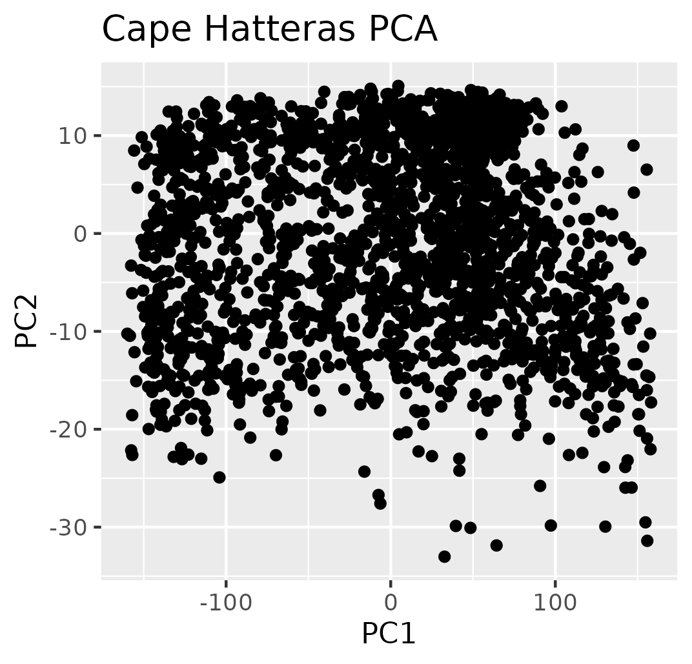

##Introduction

My project will use climatology data from three NOAA buoys near Cape Hatteras, Duck, and Beaufort North Carolina to understand the trends in water temperature, specifically in relation to gulf stream changes. There was a heatwave in North Carolina in 2017 that may have been amplified by a Gulf Stream warm core ring.

To test this, we can compare water temperature above the Gulf Stream (Duck), at Gulf Stream shift (Cape Hatteras), and below the Gulf Stream (Beaufort). In theory, if the Gulf stream did release a warm core ring, there would be a rapid increase in temperature most likely starting at the Duck buoy. We can also compare rates of warming between these three locations and see the overall trends in water temperature on the NC Coast.

These datasets have a variety of climate based variables including air temperature, water temperature, wind speed, atmospheric pressure, and a few other variables that may be of interest.

Measurements are taken every 6 minutes, and the dataset spans from 2016 to present day. To make these datasets easily usable, we will average measurements each day.

Here are the figures I have so far :)

##Figures

   Linear models for each buoy site. It appears that Beaufort may have the most significant increase in temperature over time.

   Yearly trends for each buoy site. Beaufort hits a much higher temperature than Cape Hatteras and Duck. 2017 does not seem to be dramatically different than other years.

   PCA for each buoy site. There seem to be at least one cluster in each site. From the summary table, two components explain \~99% of the variance (after removing latitude, longitude, and month) Next steps may include a clustering analysis.

To address the warming in 2017, there doesn't seem to be any obvious trends. Next steps include looking into sattelite data/literature to narrow down when the warm core ring would have been present.
